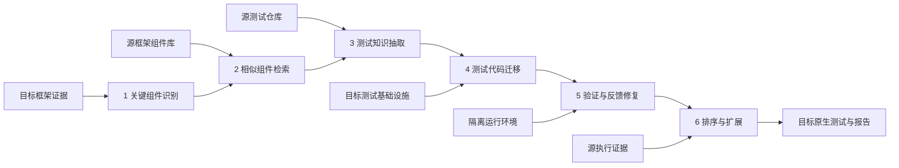

# CoSMiT 系统架构

## 总体结构

## 分层

### Domain

只表达稳定概念：`ComponentId`、`CriticalitySignals`、`SimilaritySignals`、`TestKnowledge`、`MigrationCandidate` 和验证/排序结果。Domain 不依赖具体框架、LLM、向量库或执行器。

### Application / Pipeline

负责编排六阶段、校验 artifact 前置条件、记录运行 manifest 和失败状态。每个阶段的输入输出必须可序列化、可版本化、可重放。

### Ports

定义组件扫描、文档获取、历史记录、相似检索、测试解析、代码迁移、静态分析、隔离执行、差分 oracle、LLM 和 artifact store 接口。

### Adapters

当前实现 TensorFlow 和 PyTorch 特有的组件命名、签名、测试基类、断言、设备、dtype 和执行逻辑。未来新增其他框架时不应修改 Domain。

### Infrastructure

提供 Git/issue 数据采集、向量索引、结构化存储、容器/进程隔离、日志和实验追踪。

## Artifact 契约

| Artifact | 最小内容 |
| --- | --- |
| `critical_components` | 组件 ID、五维证据、总分、排名、证据来源 |
| `component_matches` | 源/目标 ID、六维证据、权重、总分、排名、不等价条件 |
| `test_knowledge_bundles` | 源位置、六类结构单元、九类意图、参数约束、oracle |
| `migration_candidates` | 目标代码、知识 ID、转换记录、生成器版本 |
| `validated_candidates` | 静态结果、动态结果、环境、输出、数值、修复历史 |
| `ranked_tests` | 意图保持结果、覆盖增益、差分结果、价值分和成本 |

每个 artifact 文件还必须包含：`schema_version`、`run_id`、`created_at`、输入摘要、配置摘要和工具版本。

## 失败语义

Pipeline 级状态使用 `pending/running/succeeded/failed/skipped`；迁移候选使用 `generated/static_rejected/repairable/validated/discarded`。阶段失败不覆盖先前 artifact，重跑生成新的 `run_id`。

“源测试失败、目标测试也失败”不能视为一致；源测试必须先通过可重复性检查，目标测试才有资格进入差分验证。

## 安全边界

- 外部框架测试默认在无网络、受限 CPU/内存/GPU 和超时环境中执行。
- 禁止把仓库密钥、环境变量和宿主目录透传给生成测试。
- 生成代码在执行前必须通过 AST/导入白名单和危险调用检查。
- 日志对路径、令牌、用户信息和测试数据执行脱敏。

## 当前代码对应

`src/cosmit/domain/` 实现领域模型，`src/cosmit/pipeline/stages.py` 固化六阶段和 artifact 依赖，`src/cosmit/engine/` 提供六阶段 MVP，`src/cosmit/runner.py` 负责 TensorFlow ↔ PyTorch 双向编排和 artifact manifest，`src/cosmit/adapters/` 保留真实框架仓库接入边界。下一步是用真实仓库自动构建组件画像和测试索引，替换当前示例输入。
